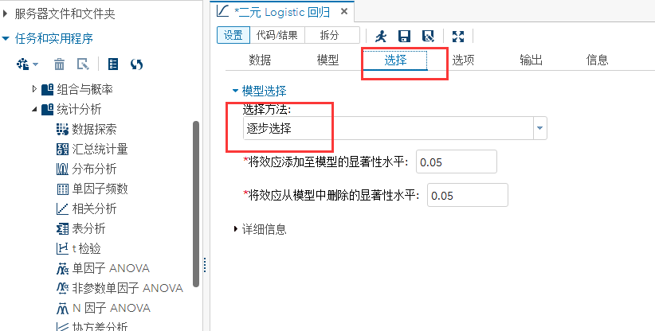

# SAS逻辑回归建模要点

`made by dch`

* > 数据准备

  * 第一步：源数据的拆分、变换

    * 处理方法

      

    * 处理后的结果

      * 拆分的结果

        

      * 转换的结果

        

      

  * 第二步：数据的合法性检查、异常值检查

    * 将上述xlsx文件导入SAS University为d9

      * 先要设置共享文件夹

        

      * 将xls文件放入共享文件夹

        

      * 右键导入数据，默认输出名为“IMPORT”的数据集，可以自己更改输出数据集的名字

        

    * 查看数据的汇总统计量

      

      

    * 结果

      

    * 结果解读

      无缺失，x2的量级明显跟其他x不同，说明需要对x1-x7进行标准化

  * 第三步：x1-x7数据标准化

    * 操作

      

      

    * 对输出集zd9重新查汇总统计量，结果

      

* > logistic回归

  * 操作

    

    

    

  * 结果

    

    

    

  * 结果解读

    * logistic回归模型
      $$
      logit(p)=ln(\frac{p}{1-p})=-0.4566+0.4592x_1+0.4501x_4
      $$
      其中$p=P\{y1=1|x_1,x_4\}$，或者使用另一形式的logistic回归模型
      $$
      p=\frac{e^{-0.4566+0.4592x_1+0.4501x_4}}{1-e^{-0.4566+0.4592x_1+0.4501x_4}}
      $$

    * 模型显著性和参数显著性

      - 由似然比、评分、Wald的P值均小于0.05说明建立的logistic回归模型是线性显著的
      - 由Intercept、x1、x4的P值均小于0.05说明这三项系数显著，说明y1生命正向主要受x1风险偏好和x4直觉型两个因素影响
      - 由x1的优比估计1.583知当x1变动一个单位的时候，y1生命正向的发生比将提高1.583倍，由x2的优比估计1.569知当x1变动一个单位的时候，y1生命正向的发生比将提高1.569倍

    * 预测准确性

      由一致部分所占百分比知道预测准确性在65.6%，ROC曲线偏离对角线说明有预测效果